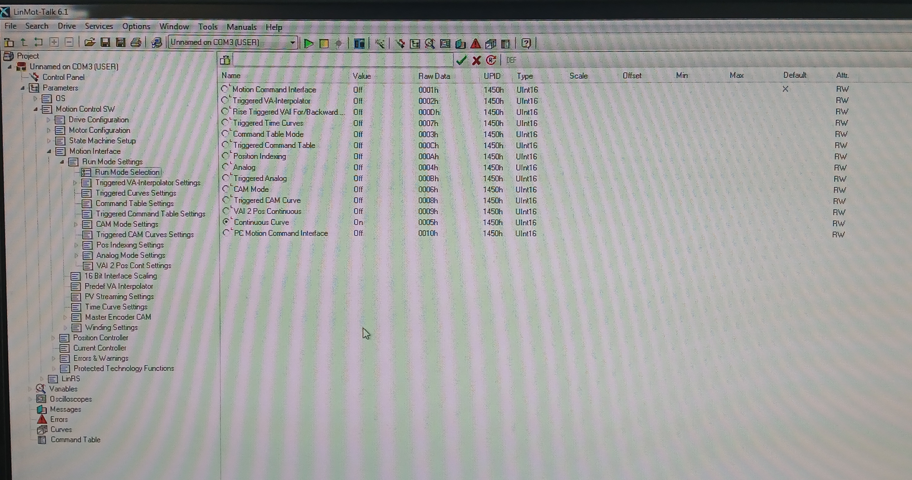
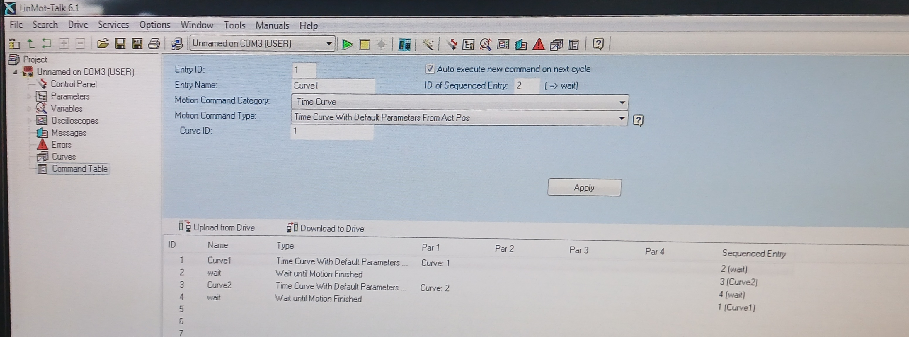
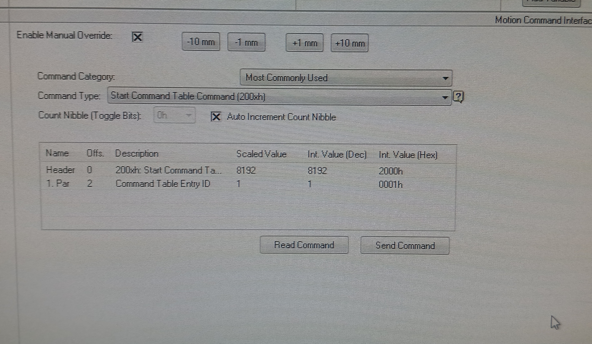

# Utilización de la Command Table para alternar entre curvas (LinMot Talk)

En este documento se describe la configuración de la **Command Table** para alternar entre dos curvas de forma cíclica en el drive.

---

## 1) Carga de curvas en el drive

Primero se deben cargar las curvas deseadas en la memoria del drive.

Esto se realiza desde LinMot Talk en la sección **Curves** (panel izquierdo), como se hace usualmente.

Durante la carga es importante cambiar el **Curve ID** en **Curve Properties** para cada curva.

---

## 2) Configuración del modo de ejecución

En el árbol izquierdo, en:

**Run Mode Selection**

se debe seleccionar:

- `Command Table Mode`

Por defecto suele estar en:

- `Continuous Curve`

---

## 3) Configuración de la Command Table

En la sección **Command Table** del panel izquierdo se cargan los comandos que definirán la secuencia de ejecución.

---

### Ejemplo: alternar entre dos curvas

Se puede alternar entre:

- Curve ID = 1  
- Curve ID = 2  

en forma cíclica.

La tabla queda:

| Entry ID | Entry Name | Motion Command Category | Motion Command Type                             | Curve ID | Auto Execute new command on next cycle | ID of Sequenced Entry |
|----------|------------|-------------------------|-------------------------------------------------|----------|----------------------------------------|-----------------------|
| 1        | Curve1     | Time Curve              | Time Curve With Default Parameters From Act Pos | 1        | True                                   | 2                     |
| 2        | wait       | Conditions              | Wait until Motion Finished                      | -        | True                                   | 3                     |
| 3        | Curve2     | Time Curve              | Time Curve With Default Parameters From Act Pos | 2        | True                                   | 4                     |
| 4        | wait       | Conditions              | Wait until Motion Finished                      | -        | True                                   | 1                     |

---

## 4) Interpretación del funcionamiento

La lógica es:

- Ejecutar curva
- Esperar finalización
- Ejecutar la siguiente curva
- Repetir en loop

El campo **Auto Execute** funciona como una cadena automática (similar a animaciones en PowerPoint), donde cada entrada dispara la siguiente al terminar.

---

## 5) Activación del sistema (Control Panel)

En el panel de control:

### a) Switch On
- Activar `Switch On`
- La primera casilla se marca
- La segunda se desmarca y vuelve a marcarse

### b) Homing
- Activar homing marcando las casillas correspondientes
- El sistema realiza el homing automático

### c) Habilitación de comandos
- Luego del homing, se desactiva la segunda casilla
- Esto habilita la ejecución vía Command Table

---

## 6) Envío del comando

En el panel inferior izquierdo se configura el comando a enviar:

Se debe seleccionar:

- **Command:** `Start Command Table Command (200xh)`
- **Command Table Entry ID:** `Scaled Value = 1`
- Activar:
  - `Enable Manual Override`
  - `Auto Increment Count Nibble`

---

## 7) Ejecución

Presionar:

- **Send Command**

y el sistema comienza la ejecución de la Command Table.

En este caso se probaron:

- dos senos de 100 mm de amplitud  
- uno rápido (T = 2 s)  
- uno lento (T = 10 s)  

para validar el funcionamiento correcto del sistema.

---

## 8) Exportación de la Command Table

La Command Table puede exportarse desde: `File → Export → Filename.lmc → Command Table` 

El archivo resultante es un:

- `.lmc`

La idea futura es analizar este archivo para generar automáticamente Command Tables desde Python, por ejemplo alternando aleatoriamente entre múltiples Curve IDs.

---

## 9) Estructura del archivo .lmc

El archivo de configuración de la Command Table consiste en una estructura tipo bloques: `[...]` 

similar a JSON, donde cada bloque representa una línea de la tabla.

Solo algunas líneas están activas (en este caso 4), el resto (251) están vacías.

---

### Ejemplo de línea válida
`[A #1 42753 'Curve1' 4 1 [A 1 0 0 0 0 0 0 0 0 0 0 0 0 0 0 ] 2 ]`

---

### Interpretación de campos

- `A`: constante del formato  
- `#1 / #0`: indica si la entrada está activa  
- `42753`: valor fijo del sistema  
- `'Curve1'`: nombre del entry  
- `4`: tipo de comando  
  - `4` → ejecutar curva  
  - `33` → esperar finalización  
- `1`: constante  
- Array interno:
  - primer valor → `Curve ID`
  - en `wait` es `0`
- `2`: siguiente entry a ejecutar  

---

## 10) Objetivo futuro

Se busca automatizar la generación de archivos `.lmc` desde Python para:

- Alternar entre múltiples curvas (≈10 o más)
- Generar secuencias aleatorias
- Escalar hasta ~122 curvas
- Duraciones totales ~20 minutos por experimento
